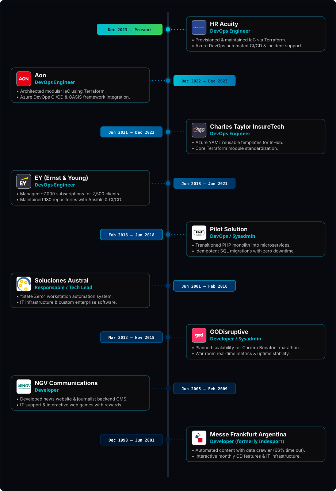

<div align="center">

  <!-- HERO BANNER -->
  

  <!-- TYPING SVG SUBTITLE -->
  <a href="https://git.io/typing-svg">
    
  </a>

  <!-- PROFILE SUMMARY BADGES / STATUS -->
  <p align="center">
    
    
    
  </p>

</div>

---

### 🌊 About Me

> **"From developer to DevOps — I bring a coder's mindset to infrastructure."**

```yaml
profile:
  name: "Leon Alvarez"
  title: "DevOps & Software Engineer"
  enterprise_brand: "Soluciones Austral"
  core_philosophy: "Infrastructure as craft. Clean architecture, automation, and operational resilience."
  metrics:
    experience: "20+ Years (since 1998)"
    cloud_subscriptions_managed: "7000+"
    repositories_maintained: "180+"
  key_domains:
    - "Infrastructure as Code (IaC): Terraform, OpenTofu, ARM Templates, Ansible"
    - "Cloud Platforms & Multi-Cloud: Azure, AWS, Oracle Cloud"
    - "CI/CD & Deployment Automation: Azure DevOps, GitHub Actions, GitLab"
    - "Container Orchestration & Microservices: Kubernetes, Helm, Docker"
```

My journey started in 1998 as a developer, crafting interactive CDs and web applications. Over two decades, I evolved through sysadmin roles into enterprise DevOps, giving me a unique perspective that bridges application code and high-fidelity cloud infrastructure.

- **HR Acuity & Charles Taylor:** Standardizing project delivery with reusable Terraform modules and robust Azure DevOps YAML pipelines.
- **EY (Ernst & Young):** Automation processes and infrastructure guidelines managing ~7,000 application subscriptions across 2,500 enterprise clients, maintaining 180 repositories with Ansible and CI/CD.
- **Soluciones Austral:** Engineering "State Zero" automated systems for workstation security and deploying business IT infrastructure and management software.

---

### 🌲 Career Timeline Tree (20+ Years Journey)

<div align="center">
  
</div>

---

### 🛠️ Tech Ecosystem

<div align="center">

#### 🔹 Cloud Platforms & Containers
<p>
  
  
  
  
  
  
</p>

#### 🔹 Infrastructure as Code & CI/CD
<p>
  
  
  
  
  
  
</p>

#### 🔹 Scripting, Databases & Systems
<p>
  
  
  
  
  
  
</p>

</div>

---

### 📡 Connect & Work Together

<div align="center">

  <a href="https://linkedin.com/in/locoxella" target="_blank">
    
  </a>
  &nbsp;
  <a href="mailto:leon@solucionesaustral.com">
    
  </a>
  &nbsp;
  <a href="https://www.solucionesaustral.com" target="_blank">
    
  </a>
  &nbsp;
  <a href="https://github.com/locoxella" target="_blank">
    
  </a>

  <br/><br/>

  <!-- VISITORS COUNTER -->
  

</div>

---

### 📊 GitHub Activity & Metrics

<div align="center">
  <table border="0">
    <tr>
      <td width="50%" align="center">
        
      </td>
      <td width="50%" align="center">
        
      </td>
    </tr>
    <tr>
      <td colspan="2" align="center">
        
      </td>
    </tr>
  </table>
</div>

---

### 🐍 Contribution Matrix

<div align="center">
  <picture>
    <source media="(prefers-color-scheme: dark)" srcset="https://raw.githubusercontent.com/locoxella/locoxella/output/github-contribution-grid-snake-dark.svg">
    <source media="(prefers-color-scheme: light)" srcset="https://raw.githubusercontent.com/locoxella/locoxella/output/github-contribution-grid-snake.svg">
    
  </picture>

  <br/><br/>
  
  

</div>
