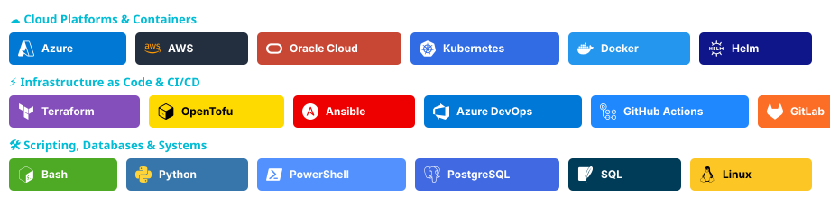
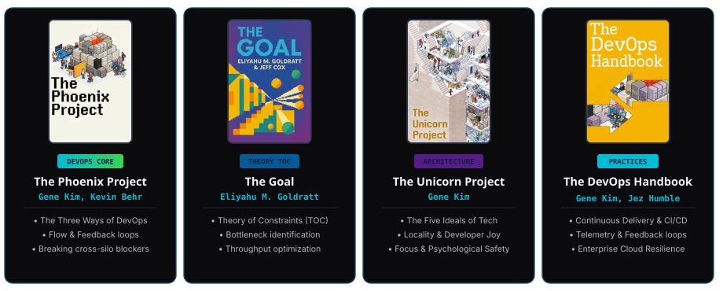
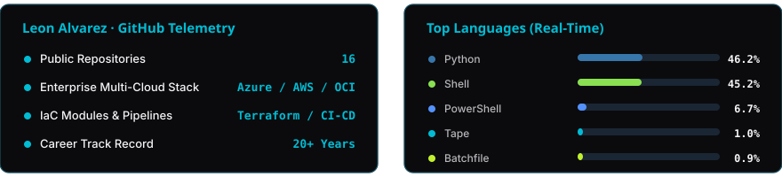

<div align="center">

  <!-- HERO BANNER -->
  

  <!-- TYPING SVG SUBTITLE -->
  <a href="https://git.io/typing-svg">
    
  </a>

  <!-- PROFILE SUMMARY BADGES / STATUS -->
  <p align="center">
    
    
    
  </p>

</div>

---

### 🌊 About Me

> **"From developer to DevOps — I bring a coder's mindset to infrastructure."**

```yaml
profile:
  name: "Leon Alvarez"
  title: "DevOps & Software Engineer"
  enterprise_brand: "Soluciones Austral"
  core_philosophy: "Infrastructure as craft. Clean architecture, automation, and operational resilience."
  languages:
    - "Spanish (Native)"
    - "English (Fluent / Professional)"
    - "Mandarin Chinese (Learning / Hobby)"
  metrics:
    experience: "20+ Years (since 1998)"
    cloud_subscriptions_managed: "7000+"
    repositories_maintained: "180+"
  key_domains:
    - "Infrastructure as Code (IaC): Terraform, OpenTofu, ARM Templates, Ansible"
    - "Cloud Platforms & Multi-Cloud: Azure, AWS, Oracle Cloud"
    - "CI/CD & Deployment Automation: Azure DevOps, GitHub Actions, GitLab"
    - "Container Orchestration & Microservices: Kubernetes, Helm, Docker"
```

My journey began in 1998 as a developer building web applications and content engines. Over two decades, my evolution was defined by critical operational milestones:
- **Foundations & Scalability (GODisruptive & Soluciones Austral):** Designing "State Zero" automated systems and leading high-concurrency war room operations during massive live events (Carrera Bonafont marathon).
- **Architecture & Microservices (Pilot Solution):** Spearheading monolith-to-microservices migrations and zero-downtime database release strategies.
- **Enterprise DevOps & Multi-Cloud (EY, Charles Taylor, Aon & HR Acuity):** Automating ~7,000 cloud subscriptions across 2,500 enterprise clients, engineering reusable Terraform IaC modules, and operating mission-critical Azure DevOps CI/CD pipelines.

<p align="center">
  
  
  
</p>

---

### 📜 Technical Certifications & Foundations

<div align="center">
  <p>
    <a href="https://www.credly.com/badges/0070ecaf-0478-41a5-aae5-619b4aadac64" target="_blank">
      
    </a>
    &nbsp;
    <a href="https://www.credly.com/badges/d8e2ad4e-a40c-4b2d-97c8-0ea6482598f6" target="_blank">
      
    </a>
  </p>
  <sub><i>Certified knowledge & continuous hands-on enterprise practice. Click badges to verify on Credly.</i></sub>
</div>

---

### 🌲 Career Timeline Tree (20+ Years Journey)

<div align="center">
  
</div>

---

### 🛠️ Tech Ecosystem

<div align="center">
  
</div>

---

### 📡 Connect & Work Together

<div align="center">

  <a href="https://linkedin.com/in/locoxella" target="_blank">
    
  </a>
  &nbsp;
  <a href="mailto:leon@solucionesaustral.com">
    
  </a>
  &nbsp;
  <a href="https://www.solucionesaustral.com" target="_blank">
    
  </a>

  <br/><br/>

  <!-- VISITORS COUNTER -->
  

</div>

---

### 📚 DevOps & Engineering Reading Showcase

<div align="center">
  
</div>

---

### 📊 GitHub Activity & Metrics

<div align="center">
  
</div>

---

### 🐍 Contribution Matrix

<div align="center">
  <picture>
    <source media="(prefers-color-scheme: dark)" srcset="https://raw.githubusercontent.com/locoxella/locoxella/output/github-contribution-grid-snake-dark.svg">
    <source media="(prefers-color-scheme: light)" srcset="https://raw.githubusercontent.com/locoxella/locoxella/output/github-contribution-grid-snake.svg">
    
  </picture>

  <br/><br/>
  
  

</div>
